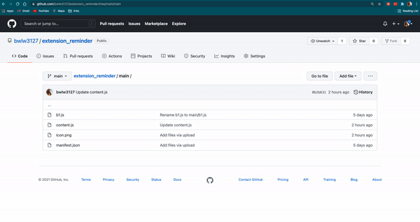
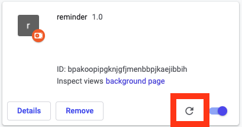

# extension_reminder

## Situation
Data cleansing is a big part of any data analyst's duty. But it's also a chore phase that we will never enjoy.

As a data team for a new internet product, there are always issues that we have to deal with:

- **The data cleansing instruction is still in flux:** Our product is new. The policy on what data we want and in what form it should be displayed is constantly changing. We need to find a way to get everyone on the same page and remember the new rules so we can have a stable and consistent result.
    
- **Too many items under each point:** The data we should be getting is listed in bullet points form. But the nested structure is too deep. Sometimes people forget to look at the point and the result is incomplete
    
- **Switching pages is annoying:** The surest way to make sure we have done everything right is to keep visiting the data cleanup guideline. But switching between tabs or windows is really annoying and increases the chances of making mistakes.
 
## The Extension
This extension creates a reminder section in your work window by adding a brand new div.

The reminder has the following features:

- **Data in the tree structure:** The data is displayed in the nested set model. Since we have deep, complicated structures, tree format is easier for the analyst to read them and see the whole picture.
- **Strikethrough feature:** When users complete an item, cross it out. Just like a simple checklist.
- **External link to the guideline page:** If users want to know more about a specific item, they can click the link and go to that page.
- **Close button:** A close button is necessary. Our reminder div is an additional element that sometimes obscures the original design. Use a close button to remove it when the user no longer needs it.
- **Eye-friendly color choice:**  The color choice is borrowed from the classic design notebook. I think this is the most eye-friendly and nostalgic color combination.

## How to install unpacked extensions:
Go to the extension page (chrome://extensions/) > click the developer mode (top right) > click on load unapacked (top left) > upload the entire folder

## To update the unpacked extensions:
Click on the extension's reload button.

